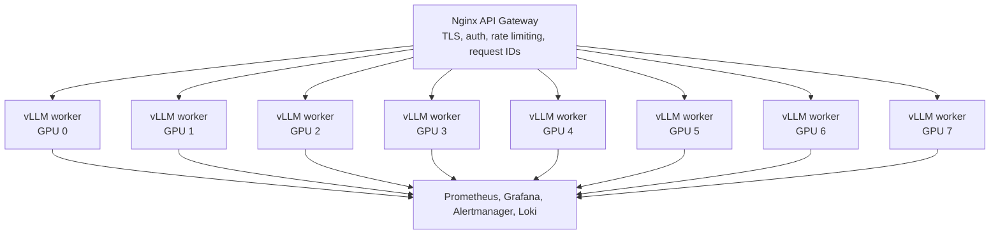

# Mistral 7B Production Deployment — 8xH100 Node

This repository is tuned for serving `mistralai/Mistral-7B-Instruct-v0.3` on a dedicated `8x H100 80GB` node with:

- `8` vLLM workers
- `1` worker pinned per GPU
- `Nginx` for auth, rate limiting, and request routing
- `Prometheus`, `Grafana`, `Alertmanager`, `Loki`, and `Promtail` for operations

The baseline goal is production-grade multi-user inference with tool/function calling support and enough observability to tune real traffic safely.

## Architecture Overview



## Why This Topology

- `Mistral 7B` is small enough that splitting one model instance across all `8` GPUs is usually unnecessary.
- `1 worker per GPU` is the cleanest baseline for aggregate multi-user throughput and operational isolation.
- A single unhealthy worker only costs `1/8` of capacity and is easy to replace during a rolling update.
- Treat `2 workers per GPU` as an experiment only after benchmarking realistic traffic.

## Prerequisites

- Ubuntu or another Linux distribution with NVIDIA drivers installed
- `8` visible H100 GPUs
- Docker Engine
- Docker Compose plugin
- NVIDIA Container Toolkit / NVIDIA runtime available to Docker
- TLS certificate and key at `nginx/certs/server.crt` and `nginx/certs/server.key`

The current deployment flow assumes Docker is installed on the target host.

Required host software:

- NVIDIA driver stack with `nvidia-smi`
- Docker Engine
- Docker Compose plugin
- NVIDIA Container Toolkit with Docker runtime integration
- `curl`
- `jq`
- `git`
- `openssl`

Optional but useful:

- `python3` for ad hoc benchmarking helpers
- DCGM exporter on the host if you want GPU metrics at `:9400`

Use `scripts/host-prereqs.sh` to check, report, and optionally install the missing software on Ubuntu hosts.

## Quick Start

```bash
# 1. Configure environment
cp .env.example .env

# 2. Review .env and nginx/api_keys.conf

# 3. Launch the stack
./scripts/deploy.sh start

# 4. Verify model worker and gateway health
./scripts/deploy.sh health

# 5. Run the smoke test
./scripts/smoke-test.sh
```

## Host Prerequisite Script

The host checker supports three modes:

```bash
# Check the current machine
./scripts/host-prereqs.sh check

# Check and print a fuller summary
./scripts/host-prereqs.sh report

# Install missing required software on Ubuntu
./scripts/host-prereqs.sh install
```

Notes:

- `install` uses `apt` and `sudo`
- Docker installs from the official Docker apt repository
- NVIDIA Container Toolkit installs from the NVIDIA apt repository
- if Docker is newly installed, you may need to log out and back in for the `docker` group change to apply
- optional Python packages can be installed with `INSTALL_OPTIONAL=1 ./scripts/host-prereqs.sh install`

## Before The Box Is Free

You can prepare the benchmarking workflow locally before touching the node:

- review `.env` defaults
- decide the first benchmark matrix
- pre-stage TLS certs and API keys
- review `scripts/benchmark.sh`
- decide which workload shape matters most: `chat`, `stream`, or `tools`

## Baseline Topology

- `8` vLLM workers total
- `1` worker bound to each GPU via `NVIDIA_VISIBLE_DEVICES`
- host ports `8000` through `8007` exposed for direct worker health and debugging
- `Nginx` fronts the workers on `80/443`
- `Grafana` on `3000`
- `Prometheus` on `9090`
- `Alertmanager` on `9093`
- `Loki` on `3100`

## Default Tuning

The defaults in `.env.example` are biased toward using the H100s rather than preserving tiny test-box headroom:

- `GPU_MEMORY_UTILIZATION=0.90`
- `MAX_MODEL_LEN=8192`
- `MAX_NUM_BATCHED_TOKENS=16384`
- `MAX_NUM_SEQS=256`
- `MODEL_DTYPE=fp8`
- `VLLM_CPU_LIMIT=10`
- `VLLM_MEM_LIMIT=48g`
- `VLLM_SHM_SIZE=8g`

These are good starting points, not guaranteed final values. You should tune them against:

- time-to-first-token
- end-to-end latency
- queue depth
- tokens/sec
- 429 rate
- 5xx rate
- GPU memory pressure

## Tool / Function Calling

The serving stack is configured with:

- `--enable-auto-tool-choice`
- `--tool-call-parser mistral`

This enables OpenAI-compatible tool/function calling behavior through vLLM for Mistral Instruct.

## Configuration Checklist

Before first deployment, review:

- `.env.example` and create `.env`
- `nginx/api_keys.conf` for valid API keys
- `nginx/nginx.conf` for gateway policy
- `nginx/certs/server.crt`
- `nginx/certs/server.key`
- `monitoring/prometheus/alertmanager.yml` for Slack/email routing

## Operational Flow

Common commands:

```bash
./scripts/deploy.sh start
./scripts/deploy.sh health
./scripts/deploy.sh status
./scripts/deploy.sh logs
./scripts/deploy.sh logs vllm-g3
./scripts/deploy.sh rolling-update
./scripts/deploy.sh stop
```

What the deploy script does:

1. Runs preflight checks for Docker, NVIDIA runtime, GPU count, disk, and `.env`.
2. Starts monitoring services first.
3. Starts all `8` vLLM workers.
4. Waits for all workers to report healthy.
5. Starts `Nginx` and the Nginx Prometheus exporter.

## Benchmarking

Use `scripts/benchmark.sh` for concurrent multi-user load tests against the OpenAI-compatible API.

Example runs:

```bash
# Baseline chat benchmark
TOTAL_REQUESTS=400 CONCURRENCY=32 ./scripts/benchmark.sh

# Streaming benchmark
TEST_MODE=stream TOTAL_REQUESTS=200 CONCURRENCY=24 ./scripts/benchmark.sh

# Tool-calling benchmark
TEST_MODE=tools TOTAL_REQUESTS=200 CONCURRENCY=24 ./scripts/benchmark.sh
```

Useful knobs:

- `ENDPOINT`
- `API_KEY`
- `MODEL`
- `TOTAL_REQUESTS`
- `CONCURRENCY`
- `MAX_TOKENS`
- `REQUEST_TIMEOUT`
- `TEST_MODE=chat|stream|tools`
- `PROMPT`

The script reports:

- successful and failed request counts
- success rate
- wall-clock duration
- observed requests/sec
- average latency
- p50 latency
- p95 latency

## First Benchmark Matrix

When the box becomes available, start with:

1. `8 workers`, `CONCURRENCY=16`, `TEST_MODE=chat`
2. `8 workers`, `CONCURRENCY=32`, `TEST_MODE=chat`
3. `8 workers`, `CONCURRENCY=64`, `TEST_MODE=chat`
4. `8 workers`, `CONCURRENCY=24`, `TEST_MODE=tools`
5. `8 workers`, `CONCURRENCY=24`, `TEST_MODE=stream`

After that, tune one variable at a time:

1. `MAX_NUM_SEQS`
2. `MAX_NUM_BATCHED_TOKENS`
3. `GPU_MEMORY_UTILIZATION`
4. `MAX_MODEL_LEN`
5. worker density per GPU

Keep the baseline fixed while changing only one knob, otherwise the results will be hard to trust.

## Tuning Checklist

For each benchmark run, record:

- worker count
- workers per GPU
- `GPU_MEMORY_UTILIZATION`
- `MAX_NUM_BATCHED_TOKENS`
- `MAX_NUM_SEQS`
- `MAX_MODEL_LEN`
- concurrency
- request mix: `chat`, `stream`, or `tools`
- success rate
- p50 latency
- p95 latency
- queue depth
- GPU memory usage
- tokens/sec
- `429` and `5xx` rates

## Monitoring

The monitoring stack is wired for:

- vLLM worker scraping per GPU
- Nginx exporter scraping
- optional host GPU scraping through DCGM exporter on `host.docker.internal:9400`
- Grafana dashboard tuned to an `8-worker` baseline
- alerts for:
  - worker down
  - queue growth
  - KV cache pressure
  - latency regression
  - throughput drop
  - GPU temperature and memory pressure

## Scaling Guidance

For this repository, “scaling” means scaling across the `8` GPUs already in the box.

Recommended order:

1. Start with `8` workers total.
2. Benchmark realistic multi-user traffic.
3. Tune batching, sequence count, rate limiting, and context length.
4. Only then test higher density such as `2 workers per GPU`.

Do not assume that more workers per GPU is better. For `Mistral 7B`, higher density can improve throughput in some workloads, but it can also hurt latency and make operations noisier.

## Kubernetes

`k8s/deployment.yaml` is kept as an alternative deployment path and now reflects the same baseline assumption:

- `8` replicas
- `1` GPU requested per pod
- HPA based on CPU utilization

For this node, Docker Compose is the primary deployment path.

## Components

| Component            | Purpose                                      |
|----------------------|----------------------------------------------|
| `docker-compose.yml` | Orchestrates `8` vLLM workers and infra      |
| `nginx/`             | API gateway with auth, rate limiting, TLS    |
| `monitoring/`        | Prometheus, Grafana, Alertmanager, Loki      |
| `scripts/`           | Deploy, health check, logs, rolling updates  |
| `k8s/`               | Alternative Kubernetes manifests             |

## Deployment Options

1. Docker Compose: `docker compose --env-file .env up -d`
2. Managed deploy script: `./scripts/deploy.sh start`
3. Kubernetes alternative: `kubectl apply -f k8s/`
