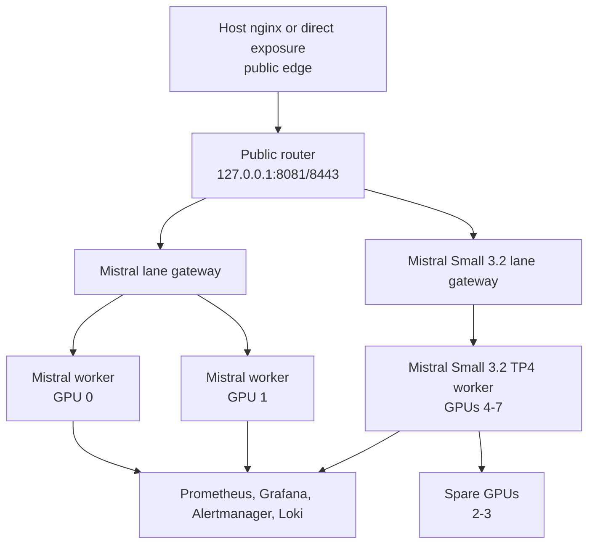

# Mixed Mistral Deployment — 8xH100 Node

This repository is now tuned for a shared-model deployment on a dedicated `8x H100 80GB` node with:

- `2` single-GPU `Mistral 7B` workers on GPUs `0-1`
- `1` `Mistral Small 3.2` worker on GPUs `4-7` with tensor parallel size `4`
- GPUs `2-3` intentionally left free
- separate internal `nginx` gateways for the `Mistral 7B` and `Mistral Small 3.2` lanes
- `Prometheus`, `Grafana`, `Alertmanager`, `Loki`, and `Promtail` for operations

The goal is to keep a lightweight `Mistral 7B` lane available while reserving most of the node for a stronger tool-calling lane using `Mistral Small 3.2`.

Additional documentation:

- [Architecture](docs/architecture.md)
- [Benchmarking](docs/benchmarking.md)
- [Deployment](docs/deployment.md)
- [Operations](docs/operations.md)
- [Monitoring](docs/monitoring.md)

On hosts that already run a system `nginx`, the recommended pattern is:

- keep the system `nginx` on public ports `80/443`
- bind the containerized public router to one internal port
- let that router fan out to the model lanes by URI

This creates a deliberate two-tier ingress model:

- host `nginx`
  Purpose: public entrypoint, host-level TLS termination, and exposure control for only `80/443`
- container `nginx` gateways
  Purpose: API-key auth, request shaping, request logging, worker load balancing, and inference-specific routing inside each model lane

That split keeps public networking concerns separate from model-serving concerns.

Current status:

- host `nginx` HTTP proxy on `80` is in place
- host-side TLS on `443` is still a follow-up item and is documented in [Deployment](docs/deployment.md) and [Operations](docs/operations.md)
- a ready-to-use host frontend example is in [nginx/host-public-nginx.conf.example](nginx/host-public-nginx.conf.example)

## Architecture Overview



## Why This Topology

- `Mistral 7B` remains small enough to run comfortably as single-GPU workers.
- `Mistral Small 3.2` is large enough that it deserves a multi-GPU lane instead of being treated like another single-GPU replica.
- `4` GPUs is the clean tensor-parallel starting point for `Mistral Small 3.2`.
- placing `Mistral Small 3.2` on GPUs `4-7` keeps the four-GPU tensor-parallel worker inside one NUMA half of the box.
- leaving GPUs `2-3` free creates room for experiments, burst capacity, or a second phase of the rollout.

## Two-Tier Ingress

This deployment uses two separate `nginx` layers on purpose.

- host `nginx`
  Role: internet-facing frontend on public `80/443`
- container `nginx`
  Role: internal API gateways for the model lanes

Why both exist:

- the host layer owns public exposure, host certificates, and the clean `80 -> 443` redirect
- the container layer owns app-specific behavior like API keys, gateway throttling, upstream retries, structured logs, and balancing inside each model lane
- keeping them separate makes it easier to change public TLS or firewall posture without rewriting the inference gateway
- it also reduces the chance of accidentally exposing internal worker paths or ports directly

## Prerequisites

- Ubuntu or another Linux distribution with NVIDIA drivers installed
- `8` visible H100 GPUs
- Docker Engine
- Docker Compose plugin
- NVIDIA Container Toolkit / NVIDIA runtime available to Docker
- TLS certificate and key at `nginx/certs/server.crt` and `nginx/certs/server.key`

The current deployment flow assumes Docker is installed on the target host.

Required host software:

- NVIDIA driver stack with `nvidia-smi`
- Docker Engine
- Docker Compose plugin
- NVIDIA Container Toolkit with Docker runtime integration
- `curl`
- `jq`
- `git`
- `openssl`
- a writable high-capacity data path such as `/mnt/compass/mistral`

If the selected `MODEL_ID` is pulled from Hugging Face, set `HF_TOKEN` in `.env` before first start. This is especially important for gated model repos.

Optional but useful:

- `python3` for ad hoc benchmarking helpers
- DCGM exporter on the host if you want GPU metrics at `:9400`

Use `scripts/host-prereqs.sh` to check, report, and optionally install the missing software on Ubuntu hosts.

## Quick Start

```bash
# 1. Configure environment
cp .env.example .env

# 2. Set HF_TOKEN if your model requires Hugging Face auth

# 3. Review .env and nginx/api_keys.conf

# 4. Launch the stack
./scripts/deploy.sh start

# 5. Verify model worker and gateway health
./scripts/deploy.sh health

# 6. Run the smoke test
./scripts/smoke-test.sh

# 7. Run targeted API tests
./scripts/api-test.sh
```

## Host Prerequisite Script

The host checker supports three modes:

```bash
# Check the current machine
./scripts/host-prereqs.sh check

# Check and print a fuller summary
./scripts/host-prereqs.sh report

# Install missing required software on Ubuntu
./scripts/host-prereqs.sh install
```

Notes:

- `install` uses `apt` and `sudo`
- Docker installs from the official Docker apt repository
- NVIDIA Container Toolkit installs from the NVIDIA apt repository
- if Docker is newly installed, you may need to log out and back in for the `docker` group change to apply
- optional Python packages can be installed with `INSTALL_OPTIONAL=1 ./scripts/host-prereqs.sh install`

## Before The Box Is Free

You can prepare the benchmarking workflow locally before touching the node:

- review `.env` defaults
- decide the first benchmark matrix
- pre-stage TLS certs and API keys
- review `scripts/benchmark.sh`
- decide which workload shape matters most: `chat`, `stream`, or `tools`

## Baseline Topology

- `mistral-g0` on GPU `0`, exposed on host port `8000`
- `mistral-g1` on GPU `1`, exposed on host port `8001`
- `small32-tp4` on GPUs `4,5,6,7`, exposed on host port `8002`
- GPUs `2` and `3` are intentionally unused in the initial mixed-model layout
- deployed app root at `/opt/compass/mistral`
- persistent data under `/mnt/compass/mistral`
- logs under `/mnt/compass/mistral/logs`
- the public router listens on `127.0.0.1:8081/8443`
- the lane gateways stay internal on the Docker network
- the host `nginx` should front the internal gateway on public ports `80/443`
- `Grafana` on `3000`
- `Prometheus` on `9090`
- `Alertmanager` on `9093`
- `Loki` on `3100`

## Default Tuning

The defaults in `.env.example` are split by lane:

- `Mistral`
  - `MISTRAL_GPU_MEMORY_UTILIZATION=0.90`
  - `MISTRAL_MAX_MODEL_LEN=8192`
  - `MISTRAL_MAX_NUM_BATCHED_TOKENS=16384`
  - `MISTRAL_MAX_NUM_SEQS=256`
- `Mistral Small 3.2`
  - `SMALL32_TENSOR_PARALLEL_SIZE=4`
  - `SMALL32_GPU_MEMORY_UTILIZATION=0.92`
  - `SMALL32_MAX_MODEL_LEN=131072`
  - `SMALL32_MAX_NUM_BATCHED_TOKENS=16384`
  - `SMALL32_MAX_NUM_SEQS=128`
- `VLLM_CPU_LIMIT=10`
- `VLLM_MEM_LIMIT=48g`
- `VLLM_SHM_SIZE=8g`

These are good starting points, not guaranteed final values. You should tune them against:

- time-to-first-token
- end-to-end latency
- queue depth
- tokens/sec
- 429 rate
- 5xx rate
- GPU memory pressure

## Tool / Function Calling

Both serving lanes are configured with:

- `--enable-auto-tool-choice`
- `--tool-call-parser mistral`

This is the current best starting point for both `Mistral 7B` and `Mistral Small 3.2`, but the `Small 3.2` lane should be revalidated with the same tool-call tests before it is treated as production-ready.

## Configuration Checklist

Before first deployment, review:

- `.env.example` and create `.env`
- `HF_TOKEN` if `MODEL_ID` is hosted on Hugging Face
- `DATA_ROOT` and related `/mnt/compass/mistral` paths
- `nginx/api_keys.conf` for valid API keys
- `nginx/nginx.conf` for gateway policy
- `nginx/certs/server.crt`
- `nginx/certs/server.key`
- `monitoring/prometheus/alertmanager.yml` for Slack/email routing

## Operational Flow

Common commands:

```bash
./scripts/deploy.sh start
./scripts/deploy.sh health
./scripts/deploy.sh status
./scripts/deploy.sh logs
./scripts/deploy.sh logs small32-tp4
./scripts/deploy.sh rolling-update
./scripts/deploy.sh stop
```

Useful validation commands:

```bash
./scripts/smoke-test.sh
./scripts/api-test.sh
TEST_MODE=tools ./scripts/api-test.sh
ENDPOINT=https://127.0.0.1:8443/v1 ./scripts/api-test.sh
```

## Router Handoff

For upstream routing teams, expose one OpenAI-compatible API entrypoint and route by URI.

Expected interface:

- Default alias: `https://<public-host>/v1`
- Explicit `Mistral` alias: `https://<public-host>/mistral/7b/v1`
- Explicit `Mistral Small 3.2` alias: `https://<public-host>/mistral/small32/v1`
- Chat completions: `POST /v1/chat/completions`
- Models: `GET /v1/models`
- Health: `GET /health`

Authentication uses a standard bearer token:

```http
Authorization: Bearer <API_KEY>
```

Example request:

```bash
curl https://<public-host>/v1/chat/completions \
  -H 'Content-Type: application/json' \
  -H 'Authorization: Bearer <API_KEY>' \
  -d '{
    "model": "mistralai/Mistral-7B-Instruct-v0.3",
    "messages": [
      {"role": "user", "content": "Hello"}
    ]
  }'
```

Current note:

- The router-facing public `443` endpoint is still pending final host TLS and cloud firewall setup.
- The current internal/public-router aliases are:
  - `https://127.0.0.1:8443/v1`
  - `https://127.0.0.1:8443/mistral/7b/v1`
  - `https://127.0.0.1:8443/mistral/small32/v1`
- `/v1` currently defaults to the `Mistral` lane, but the router config is designed so that alias can be switched later if needed.

## Changing Routing

The public router lives in:

- `nginx/router-gateway.conf`

Current explicit routes:

- `/v1` -> default alias, currently `Mistral 7B`
- `/mistral/7b/v1` -> `Mistral 7B`
- `/mistral/small32/v1` -> `Mistral Small 3.2`

If you want to change the default alias, edit the `/v1/` location in `nginx/router-gateway.conf`.

Current default:

```nginx
location /v1/ {
    proxy_pass http://mistral_lane/v1/;
    ...
}
```

To point `/v1` at `Mistral Small 3.2` instead:

```nginx
location /v1/ {
    proxy_pass http://small32_lane/v1/;
    ...
}
```

Apply the change on the box with:

```bash
docker compose up -d --force-recreate --no-deps nginx-router
./scripts/deploy.sh health
```

Recommended rule:

- keep `/mistral/7b/v1` and `/mistral/small32/v1` stable
- only change `/v1` when you want to move the default integration target
- avoid changing URI aliases, gateway names, and model IDs in the same deployment

That gives integrations a predictable explicit path per model while still letting the default alias move later if priorities change.

This only changes the default alias. The explicit namespaced routes stay stable unless you edit them directly.

What the deploy script does:

1. Runs preflight checks for Docker, NVIDIA runtime, GPU count, disk, and `.env`.
2. Starts monitoring services first.
3. Starts the two `Mistral` workers on GPUs `0-1`.
4. Starts the `Mistral Small 3.2` TP4 worker on GPUs `4-7`.
5. Waits for all three serving processes to report healthy.
6. Starts both internal gateways and both Nginx Prometheus exporters.
7. Expects the host `nginx` to proxy public traffic to the desired internal lane.

## Monitoring Access

The monitoring services run on the host, but the recommended access path is an SSH tunnel instead of public exposure.

Available services:

- `Grafana` on `localhost:3000`
- `Prometheus` on `localhost:9090`
- `Alertmanager` on `localhost:9093`
- `Loki` on `localhost:3100`

Example tunnel:

```bash
ssh -i ~/.ssh/id_ed25519_compass_mistral \
  -L 8088:localhost:80 \
  -L 8443:localhost:8443 \
  -L 3000:localhost:3000 \
  -L 9090:localhost:9090 \
  -L 9093:localhost:9093 \
  -L 3100:localhost:3100 \
  compass@<h100-server-ip>
```

Then open:

- `http://localhost:8088` for the host `nginx` entrypoint
- `https://localhost:8443` for the direct router TLS port
- `http://localhost:3000` for Grafana
- `http://localhost:9090` for Prometheus
- `http://localhost:9093` for Alertmanager

If you later want browser access without SSH tunnels, expose Grafana through the host `nginx` behind authentication instead of opening `3000` publicly.

## Benchmarking

Use `scripts/benchmark.sh` for concurrent multi-user load tests against the OpenAI-compatible API.

Example runs:

```bash
# Baseline Mistral benchmark
TOTAL_REQUESTS=400 CONCURRENCY=32 ./scripts/benchmark.sh

# Mistral Small 3.2 benchmark
TARGET_STACK=small32 TOTAL_REQUESTS=200 CONCURRENCY=8 ./scripts/benchmark.sh

# Streaming benchmark
TEST_MODE=stream TOTAL_REQUESTS=200 CONCURRENCY=24 ./scripts/benchmark.sh

# Tool-calling benchmark
TEST_MODE=tools TOTAL_REQUESTS=200 CONCURRENCY=24 ./scripts/benchmark.sh
```

Useful knobs:

- `ENDPOINT`
- `TARGET_STACK`
- `API_KEY`
- `MODEL`
- `TOTAL_REQUESTS`
- `CONCURRENCY`
- `MAX_TOKENS`
- `REQUEST_TIMEOUT`
- `TEST_MODE=chat|stream|tools`
- `PROMPT`

The script reports:

- successful and failed request counts
- success rate
- wall-clock duration
- observed requests/sec
- average latency
- p50 latency
- p95 latency

Historical measured baseline on the earlier all-`Mistral 7B` layout:

| Workload | Total Requests | Concurrency | Success Rate | Req/s | Avg Latency | P95 Latency |
| --- | --- | --- | --- | ---: | ---: | ---: |
| Chat, `MAX_TOKENS=64` | `600` | `64` | `100%` | `50.00` | `1.114s` | `1.472s` |
| Chat, `MAX_TOKENS=256` | `400` | `32` | `100%` | `22.22` | `1.425s` | `1.718s` |
| Stream, `MAX_TOKENS=128` | `200` | `24` | `100%` | `15.38` | `1.435s` | `1.995s` |
| Tools, `MAX_TOKENS=128` | `200` | `32` | `100%` | `33.33` | `0.879s` | `1.274s` |
| Soak, chat `MAX_TOKENS=128` | `15000` | `32` | `100%` | `23.40` | `1.346s` | `1.479s` |

Notes:

- these results were gathered before the mixed `Mistral 7B + Mistral Small 3.2` split
- the soak run lasted about `10.7` minutes with queue depth staying at `0`
- tool-calling results only apply after the current Mistral parser and chat-template fix in this repo
- full benchmark context and comparison guidance live in [Benchmarking](docs/benchmarking.md)

Current `Mistral Small 3.2` lane results on `/mistral/small32/v1`:

| Workload | Total Requests | Concurrency | Success Rate | Req/s | Avg Latency | P95 Latency |
| --- | --- | --- | --- | ---: | ---: | ---: |
| Chat, `MAX_TOKENS=128` | `600` | `32` | `100%` | `46.15` | `0.632s` | `0.715s` |
| Chat, `MAX_TOKENS=128` | `600` | `48` | `100%` | `60.00` | `0.683s` | `0.785s` |
| Chat, `MAX_TOKENS=128` | `800` | `96` | `100%` | `114.29` | `0.820s` | `0.987s` |
| Tools, `MAX_TOKENS=128` | `200` | `12` | `100%` | `33.33` | `0.270s` | `0.387s` |
| Tools, `MAX_TOKENS=128` | `400` | `32` | `100%` | `80.00` | `0.367s` | `0.490s` |

Notes:

- earlier `small32` runs at higher concurrency returned `429` because the lane-specific gateway safeguard was too tight
- the `small32` lane was retuned to `240 r/s` with burst `120` before the later benchmark runs above

## First Benchmark Matrix

For the mixed-model layout, start with:

1. `Mistral`, `CONCURRENCY=16`, `TEST_MODE=chat`
2. `Mistral`, `CONCURRENCY=32`, `TEST_MODE=tools`
3. `Small32`, `CONCURRENCY=4`, `TEST_MODE=chat`
4. `Small32`, `CONCURRENCY=4`, `TEST_MODE=tools`
5. `Small32`, longer outputs with `MAX_TOKENS=256`

After that, tune one variable at a time:

1. `MAX_NUM_SEQS`
2. `MAX_NUM_BATCHED_TOKENS`
3. `GPU_MEMORY_UTILIZATION`
4. `MAX_MODEL_LEN`
5. worker density per GPU

Keep the baseline fixed while changing only one knob, otherwise the results will be hard to trust.

## Tuning Checklist

For each benchmark run, record:

- worker count
- workers per GPU
- `GPU_MEMORY_UTILIZATION`
- `MAX_NUM_BATCHED_TOKENS`
- `MAX_NUM_SEQS`
- `MAX_MODEL_LEN`
- concurrency
- request mix: `chat`, `stream`, or `tools`
- success rate
- p50 latency
- p95 latency
- queue depth
- GPU memory usage
- tokens/sec
- `429` and `5xx` rates

## Monitoring

The monitoring stack is wired for:

- vLLM worker scraping per GPU
- Nginx exporter scraping
- optional host GPU scraping through DCGM exporter on `host.docker.internal:9400`
- Grafana dashboard tuned to an `8-worker` baseline
- alerts for:
  - worker down
  - queue growth
  - KV cache pressure
  - latency regression
  - throughput drop
  - GPU temperature and memory pressure

## Scaling Guidance

For this repository, “scaling” means scaling across the `8` GPUs already in the box.

Recommended order:

1. Start with `8` workers total.
2. Benchmark realistic multi-user traffic.
3. Tune batching, sequence count, rate limiting, and context length.
4. Only then test higher density such as `2 workers per GPU`.

Do not assume that more workers per GPU is better. For `Mistral 7B`, higher density can improve throughput in some workloads, but it can also hurt latency and make operations noisier.

## Kubernetes

`k8s/deployment.yaml` is kept as an alternative deployment path and now reflects the same baseline assumption:

- `8` replicas
- `1` GPU requested per pod
- HPA based on CPU utilization

For this node, Docker Compose is the primary deployment path.

## Components

| Component            | Purpose                                      |
|----------------------|----------------------------------------------|
| `docker-compose.yml` | Orchestrates `8` vLLM workers and infra      |
| `nginx/`             | API gateway with auth, rate limiting, TLS    |
| `monitoring/`        | Prometheus, Grafana, Alertmanager, Loki      |
| `scripts/`           | Deploy, health check, logs, rolling updates  |
| `k8s/`               | Alternative Kubernetes manifests             |

## Deployment Options

1. Docker Compose: `docker compose --env-file .env up -d`
2. Managed deploy script: `./scripts/deploy.sh start`
3. Kubernetes alternative: `kubectl apply -f k8s/`
