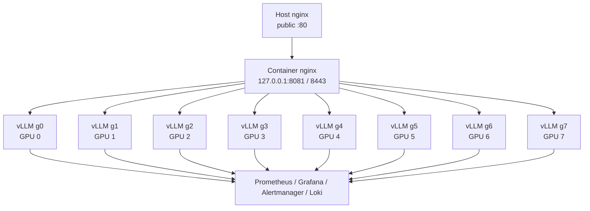

# Architecture

This deployment is designed for a single dedicated `8x H100 80GB` node serving `mistralai/Mistral-7B-Instruct-v0.3`.

## Topology

## Key Design Choices

- One `vLLM` worker per GPU is the baseline.
- The public entrypoint stays on the host `nginx`.
- The application gateway runs in Docker and binds only to `127.0.0.1`.
- Heavy persistent state lives under `/mnt/compass/mistral`.
- App code and deployment config live under `/opt/compass/mistral`.

## Two-Tier Nginx Model

This stack intentionally uses two separate `nginx` layers.

### Host Nginx

Responsibilities:

- public listener on `80/443`
- host-level TLS certificate and key management
- public `80 -> 443` redirect
- exposure control so only host `80/443` need to be opened in the firewall

### Container Gateway Nginx

Responsibilities:

- OpenAI-compatible API gateway inside the stack
- API-key authentication
- gateway rate limiting and basic ingress protection
- request ID injection and structured JSON access logs
- balancing across the eight `vLLM` workers
- worker-facing health, metrics, and gateway-specific operational endpoints

### Why Keep Them Separate

- public ingress and TLS lifecycle can change without changing the inference gateway
- the model-serving layer stays private on `127.0.0.1`
- app-specific gateway policy stays versioned with the repo
- the blast radius is smaller if the public frontend needs emergency changes
- operators can reason separately about network exposure and inference behavior

## Runtime Layout

- `/opt/compass/mistral`
  Purpose: deployed repo, compose file, configs, scripts
- `/mnt/compass/mistral/model-cache`
  Purpose: Hugging Face model weights and cache
- `/mnt/compass/mistral/vllm-cache`
  Purpose: `vLLM` compile and runtime cache
- `/mnt/compass/mistral/prometheus`
  Purpose: Prometheus TSDB
- `/mnt/compass/mistral/grafana`
  Purpose: Grafana state
- `/mnt/compass/mistral/loki`
  Purpose: Loki data
- `/mnt/compass/mistral/logs`
  Purpose: application and gateway logs

## Network Model

- Public HTTP currently terminates at host `nginx` on port `80`.
- Host `nginx` proxies to `127.0.0.1:8081`.
- Containerized `nginx` proxies to the eight `vLLM` workers over the Docker network.
- Worker health and debugging remain available on ports `8000` to `8007`.

## Current Gaps

- Host-side TLS on public `443` is not set up yet.
- External reachability depends on cloud firewall / NSG rules.
- Monitoring UIs are intended for SSH tunnel access first, not public exposure.
