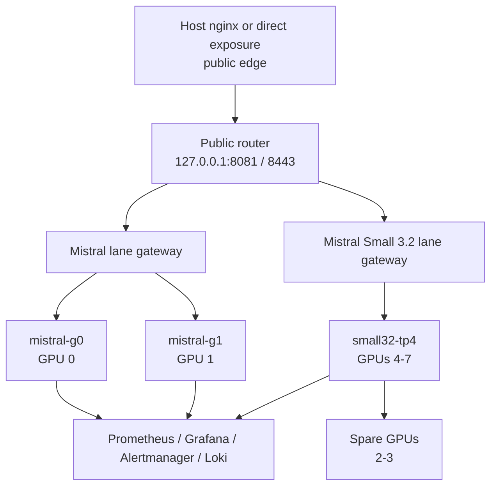

# Architecture

This deployment is designed for a single dedicated `8x H100 80GB` node serving both `mistralai/Mistral-7B-Instruct-v0.3` and `mistralai/Mistral-Small-3.2-24B-Instruct-2506`.

## Topology

## Key Design Choices

- `Mistral 7B` runs as two single-GPU workers on GPUs `0` and `1`.
- `Mistral Small 3.2` runs as one tensor-parallel worker across GPUs `4-7`.
- GPUs `2` and `3` stay free in the initial mixed-model rollout.
- The public entrypoint stays on the host `nginx`.
- The application gateways run in Docker and bind only to internal ports.
- Heavy persistent state lives under `/mnt/compass/mistral`.
- App code and deployment config live under `/opt/compass/mistral`.

## GPU Placement Logic

The chosen placement is:

- `Mistral 7B`: GPUs `0-1`
- spare capacity: GPUs `2-3`
- `Mistral Small 3.2`: GPUs `4-7`

Why this layout was chosen:

- the box exposes full `NV18` connectivity between all GPUs, so `Mistral Small 3.2` does not require a special NVLink island
- the more meaningful placement constraint is NUMA locality
- GPUs `0-3` live on one CPU/NUMA half of the machine, while GPUs `4-7` live on the other
- keeping the four-GPU `Mistral Small 3.2` worker entirely inside GPUs `4-7` avoids spanning NUMA halves for the multi-GPU model
- the lighter `Mistral` lane remains simple on GPUs `0-1`, and GPUs `2-3` stay available for future expansion

## Two-Tier Nginx Model

This stack intentionally uses two separate `nginx` layers.

### Host Nginx

Responsibilities:

- public listener on `80/443`
- host-level TLS certificate and key management
- public `80 -> 443` redirect
- exposure control so only host `80/443` need to be opened in the firewall

### Container Gateway Nginx

Responsibilities:

- public URI-based router
- lane-specific OpenAI-compatible gateways inside the stack
- API-key authentication
- gateway rate limiting and basic ingress protection
- request ID injection and structured JSON access logs
- balancing across the two `Mistral` workers or proxying into the single `Mistral Small 3.2` lane
- worker-facing health, metrics, and gateway-specific operational endpoints

### Why Keep Them Separate

- public ingress and TLS lifecycle can change without changing the inference gateway
- the model-serving layer stays private on `127.0.0.1`
- app-specific gateway policy stays versioned with the repo
- the blast radius is smaller if the public frontend needs emergency changes
- operators can reason separately about network exposure and inference behavior
- one open public port can still expose multiple model lanes by URI

## Runtime Layout

- `/opt/compass/mistral`
  Purpose: deployed repo, compose file, configs, scripts
- `/mnt/compass/mistral/model-cache`
  Purpose: Hugging Face model weights and cache
- `/mnt/compass/mistral/vllm-cache`
  Purpose: `vLLM` compile and runtime cache
- `/mnt/compass/mistral/prometheus`
  Purpose: Prometheus TSDB
- `/mnt/compass/mistral/grafana`
  Purpose: Grafana state
- `/mnt/compass/mistral/loki`
  Purpose: Loki data
- `/mnt/compass/mistral/logs`
  Purpose: application and gateway logs

## Network Model

- Public HTTP currently terminates at host `nginx` on port `80`.
- Host `nginx` should proxy to the public router on `127.0.0.1:8081`.
- The public router exposes three useful URI entrypoints:
  - `/v1`
  - `/mistral/7b/v1`
  - `/mistral/small32/v1`
- Containerized `nginx` proxies from the public router to the model-serving lanes over the Docker network.
- Worker health and debugging remain available on ports `8000`, `8001`, and `8002`.

## Current Gaps

- Host-side TLS on public `443` is not set up yet.
- External reachability depends on cloud firewall / NSG rules.
- Monitoring UIs are intended for SSH tunnel access first, not public exposure.
